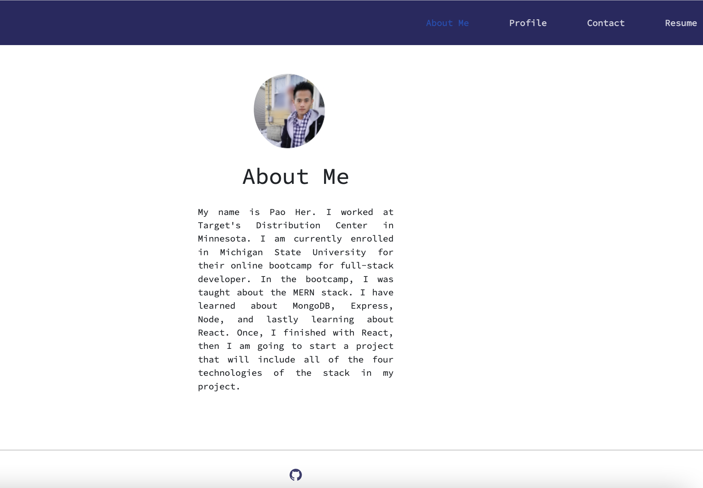
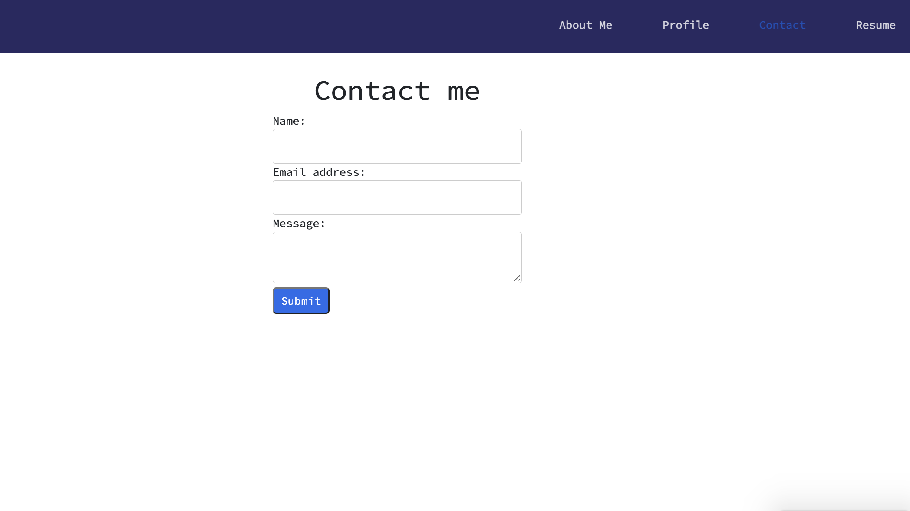
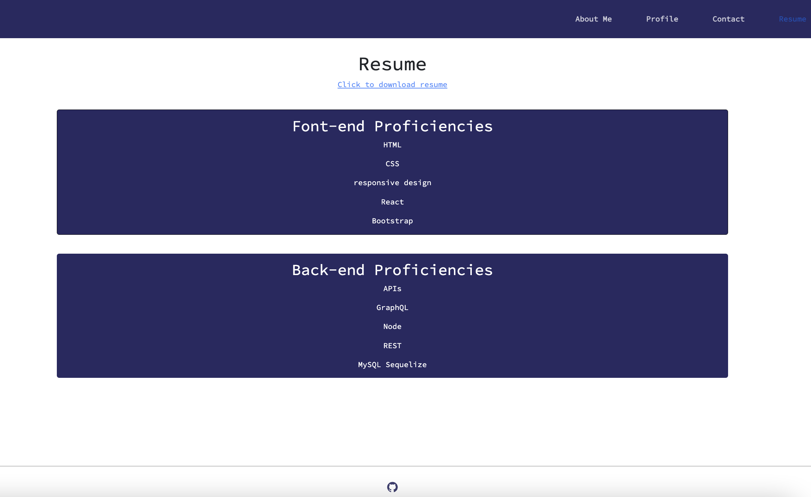
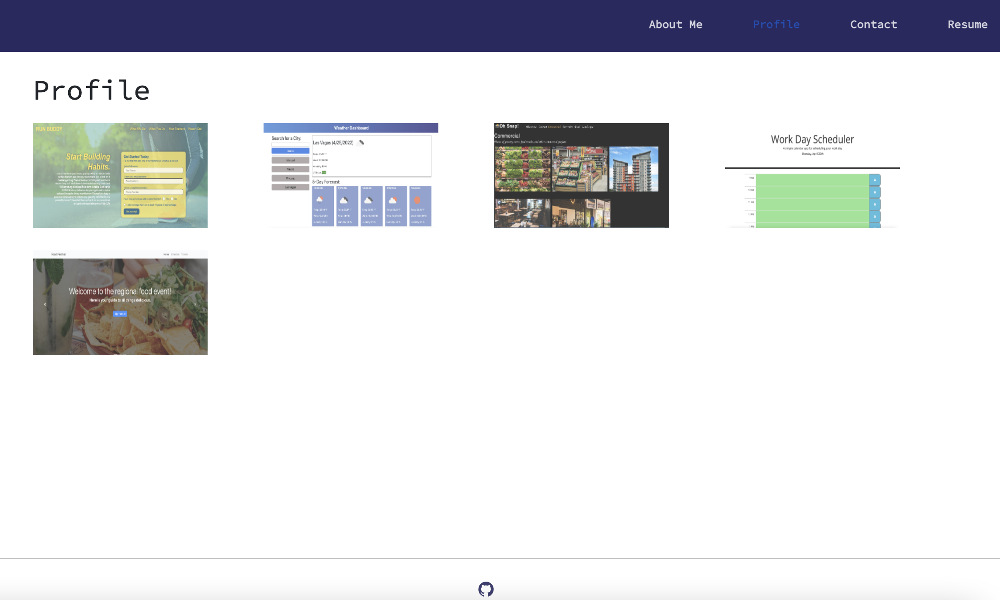

# React Portfolio

## Table of contents

1. [Title](#title)

2. [Description](#description)

3. [Usage](#usage)

4. [Technologies](#technologies)
5. [Screenshot](#screenshot)
6. [Deploy](#deploy)
7. [Questions](#questions)
## Title
React Portfolio

## Description
To create a portfolio page using the new skills that I learn React. The portfolio will include projects that I have create. When I click on any of the projects it will link them to the correct page of the project.

## Usage
run `npm start` to start the application

## Technologies
- React

## Screenshot

## Deploy
https://p-her.github.io/about

## Questions
For any questions, find me on github at: https://github.com/p-her